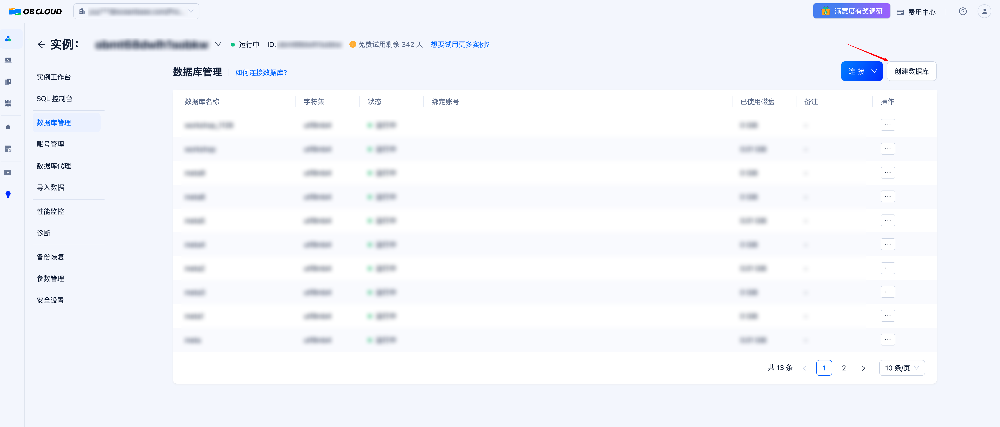
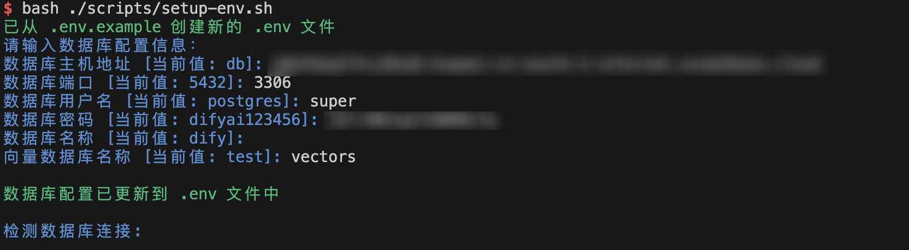
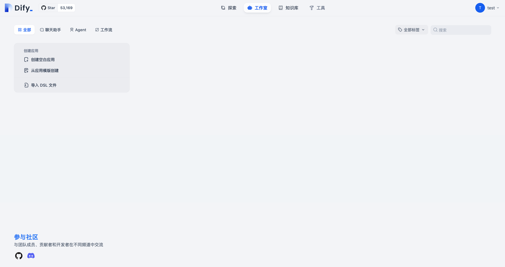
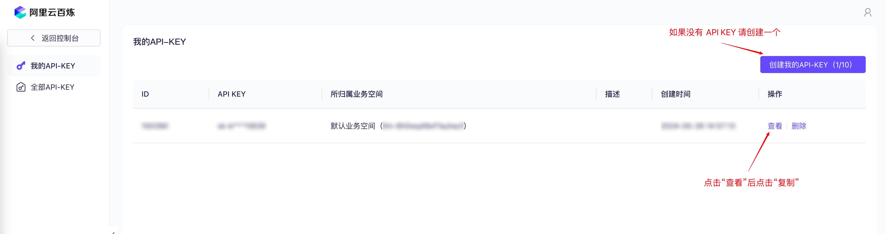
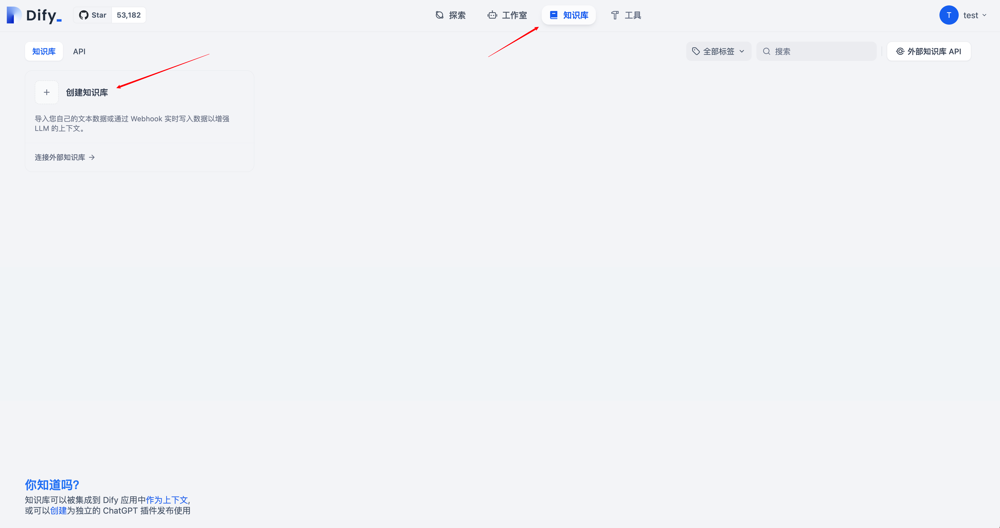
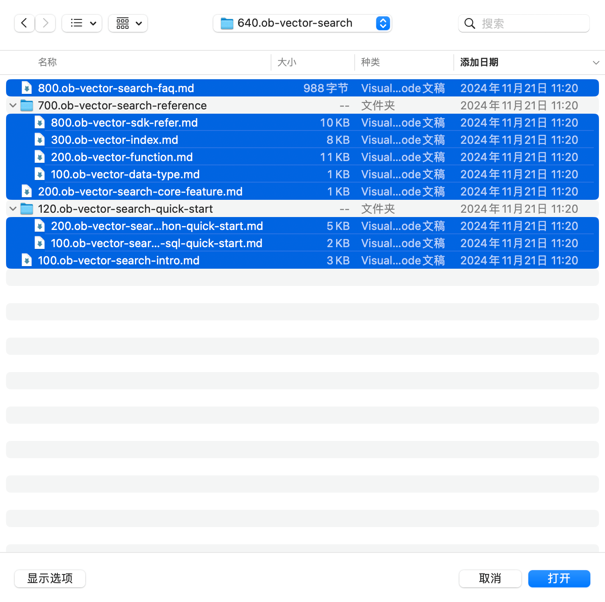
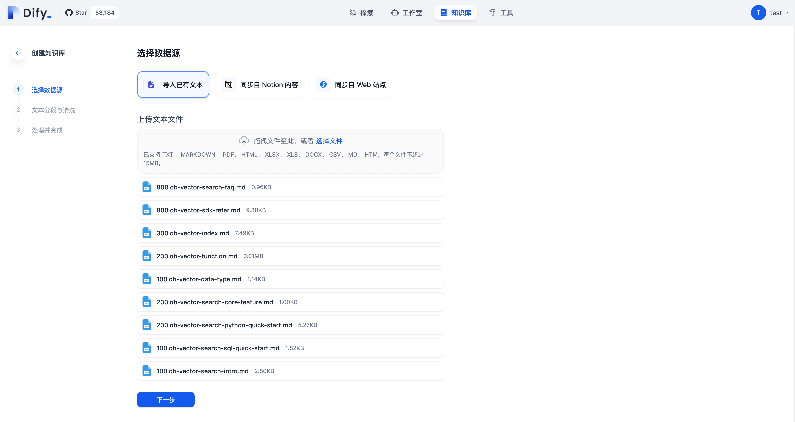
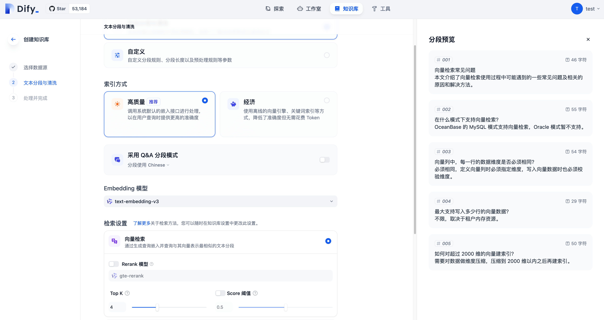
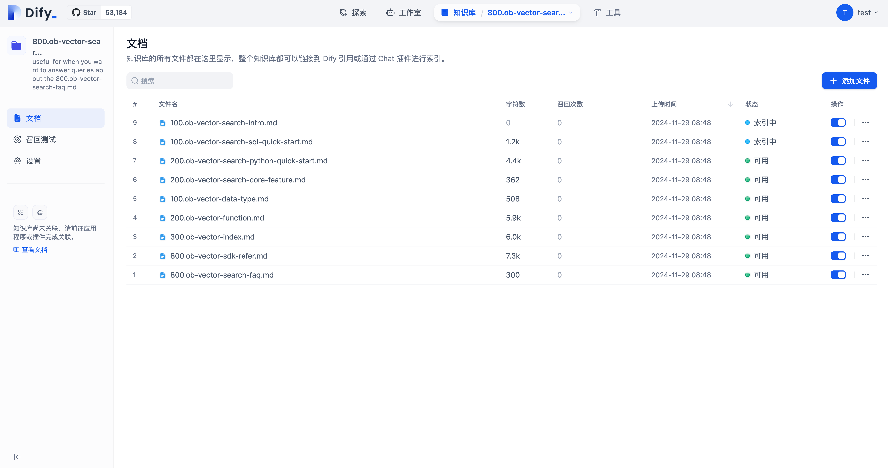
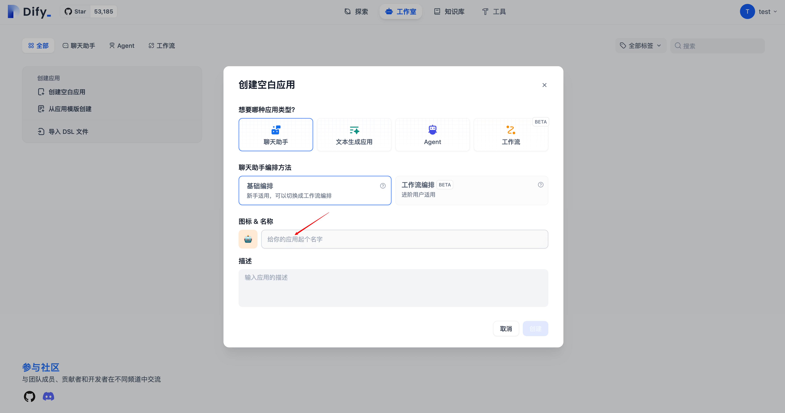

## 实验背景

Dify 是一个开源的 LLM 应用开发平台。其直观的界面结合了 AI 工作流、RAG 管道、Agent、模型管理、可观测性功能等，让您可以快速从原型到生产。OceanBase 从 4.3.3 版本开始支持了向量数据类型的存储和检索，在 Dify 0.11.0 中开始支持使用 OceanBase 作为其向量数据库。通过我们在 Fork 出来的 Dify 代码仓库 [oceanbase-devhub/dify](https://github.com/oceanbase-devhub/dify) 中进行相应的修改之后，Dify 支持使用 MySQL 协议的数据库存储结构化数据。自此，OceanBase 作为一款多模数据库，可以很好地支持 Dify 对结构化数据和向量数据的存取需求，有力地支撑其上 LLM 应用的开发和落地。

## 实验环境

- Git
- [Docker](https://docs.docker.com/engine/install/) 和 [Docker Compose](https://docs.docker.com/compose/install/)
- MySQL 客户端（可选，如果使用 Docker 部署 OceanBase 则必须）

## 平台搭建步骤

### 1. 获取 OceanBase 数据库

进行实验之前，我们需要先获取 OceanBase 数据库，目前可行的方式有两种：使用 OBCloud 实例或者[使用 Docker 本地部署单机版 OceanBase 数据库](#使用-docker-部署单机版-oceanbase-数据库)。我们在此推荐 OBCloud 实例，因为它部署和管理都更加简单，且不需要本地环境支持。

#### 1.1 注册并开通 OBCloud 实例

进入[OB Cloud 云数据库 365 天免费试用](https://www.oceanbase.com/free-trial)页面，点击“立即试用”按钮，注册并登录账号，填写相关信息，开通实例，等待创建完成。

#### 1.2 获取数据库实例连接串

进入实例详情页的“实例工作台”，点击“连接”-“获取连接串”按钮来获取数据库连接信息。在“安全设置”中，将放通的 IP 地址设置为 `0.0.0.0/0`。最后把密码和生成的形如`mysql -h obmtxxxxxx.xxxxxx.oceanbase.cloud -P 3306 -u super -D dify -p`的连接命令记下来，后续步骤中需要把这些信息填写到创建的 .env 文件内。其中, `obmtxxxxxx.xxxxxx.oceanbase.cloud` 是数据库实例的连接主机地址，`3306` 是数据库连接端口，`super` 是数据库的用户名，`dify` 是数据库的名称。


#### 1.3 创建多个数据库

为了分别存放结构化数据（满足 alembic 的数据库结构迁移方案要求）和向量数据，我们需要至少创建两个数据库。可在实例详情页面中的“数据库管理”功能中创建数据库。



### 2. 克隆项目

我们针对 Dify 的 0.12.1 版本进行了 MySQL 协议兼容的修改，并且上传到了我们 fork 的代码仓库中。大家网络条件好的话推荐克隆 Github 上的版本，否则克隆 Gitee 上的版本。

```bash
git clone https://github.com/oceanbase-devhub/dify.git
# 如果网络条件差
git clone https://gitee.com/oceanbase-devhub/dify.git
```

为保证 dify 目录的代码是最新的状态，需要执行 `git pull` 命令，拉取最新的代码。

```bash
cd dify
git pull
```

### 3. 拉取 Docker 镜像

进入到 dify 的工作目录中的`docker`目录下，执行`docker compose --profile workshop pull`，拉取所需要的镜像，这些镜像不一定都能够顺利拉取，请大家先自行寻求解决方案。

参考命令

```bash
cd docker
docker compose --profile workshop pull
```

### 4. 修改环境变量

在`docker`目录下存放着一个`.env.example`文件，其中包含了若干 Dify 运行所需的环境变量，我们需要把其中几个重要的配置项填写上。

我们在 `docker/scripts` 目录下提供了一个脚本 `setup-env.sh` 用来交互式地获取数据库连接信息，填入 `.env` 文件中并且完成数据库连接校验。你只需要执行:

```bash
bash ./scripts/setup-env.sh
```

然后按照提示输入数据库连接信息即可，大致形式如下:



如果在检测数据库连接步骤中，两个数据库都连接成功，则说明数据库连接信息填写正确，可以继续进行下一步。


### 5. 启动 Dify 容器组

启动之前先看看第 2 步开始拉取的镜像是否就绪，如果已经完成，可以使用下列命令启动 Dify 的容器组。

```bash
docker compose --profile workshop up -d
```

### 6. 查看 Dify 后端服务日志

```bash
docker logs -f docker-api-1
docker logs -f docker-worker-1
```

如果在其中任意一个容器的日志中看到了`Database migration successful!`这一条信息，则说明数据库结构升级完成（另一个容器中可能会有`Database migration skipped`表示在该容器中跳过了数据库结构迁移），如果没有其他`ERROR`信息，则说明可以正常打开 Dify 界面了。

### 7. 访问 Dify 应用

默认情况下，Dify 的前端页面会启动在本机的`80`端口上，也就是说可以通过访问当前机器的 IP 来访问 Dify 的界面。也就是说如果我在笔记本上运行的话，我在浏览器上访问`localhost`即可（或者是内网 IP）；如果在服务器上部署 Dify，则需要访问服务器的公网 IP。初次访问 Dify 应用会进入“设置管理员账户”的页面，设置完成后即可使用该账号登录。




## 应用开发步骤

在该步骤当中我们将使用阿里云百炼的模型服务，通过 Dify 搭建一个文档 RAG 问答助手。

### 1. 开通阿里云百炼模型调用服务并获取 API KEY

首先，我们需要注册[阿里云百炼](https://bailian.console.aliyun.com/)账号，开通模型调用服务并获取 API Key




### 2. 设置模型供应商和系统模型


设置完成模型供应商之后刷新网页，再向通义千问模型供应商中添加模型`qwen-plus-2024-12-20`


模型名称填 `qwen-plus-2024-12-20`，API Key 填写之前获取的百炼 API Key，模型上下文长度写 `131072`，其余选项保持默认即可。

完成系统模型设置后，刷新页面，再次进入系统模型设置页面，将系统推理模型设置为`qwen-plus-2024-12-20`，Embedding 模型设置为`text-embedding-v3`，然后点击保存。


### 3. 创建知识库并上传文档

#### 3.1 克隆文档仓库

我们在自己的电脑上将 OceanBase 数据库的开源文档仓库克隆下来，作为数据来源。

```bash
git clone --single-branch --branch V4.3.4 https://github.com/oceanbase/oceanbase-doc.git ~/oceanbase-doc
# 如果您访问 Github 仓库速度较慢，可以使用以下命令克隆 Gitee 的镜像版本
git clone --single-branch --branch V4.3.4 https://gitee.com/oceanbase-devhub/oceanbase-doc.git ~/oceanbase-doc
```

#### 3.2 将指定文档上传到知识库中

回到首页，顶端中部的“知识库”标签页，进入知识库管理界面，点击创建知识库。



为了节省时间和模型服务调用量，我们仅处理 OceanBase 向量检索有关的几篇文档，这些文档相对于`oceanbase-doc`目录的相对路径是`zh-CN/640.ob-vector-search`，我们需要将这个目录下面所有的文档都上传。






索引方式选择“高质量”，TopK 选择到 5，点击“保存并处理”。



Dify 会提示知识库“已创建”，后续可能会看到某些文档已经在此处理完成。点击“前往文档”。


点击“前往文档”后会看到该知识库中的文档列表。



### 4. 创建对话应用并选中知识库

乙巳蛇年春节临近，在这一节我们将使用 Dify 配合 OceanBase 的开源文档搭建一个 RAG 春联小助手。

点击“工作室”标签页，进入应用管理界面，点击“创建空白应用”。




保持默认选项“聊天助手”和“基础编排”即可，应用名称可以自行填写，例如 “春联小助手”。输入完成后点击“创建”按钮。

创建完成后会进入应用编排界面，首先关注右上角的默认模型设置，如果不是`qwen-plus-2024-12-20`则修改为`qwen-plus-2024-12-20`。**为了让大语言模型更具创造性，我们将“温度”选项设置为`0.8`**。


点击“上下文”卡片中的“添加”按钮，选中刚才我们创建的知识库并点击“添加”按钮。


随后，在提示词的输入框中填写如下的提示词：

```bash
[[要求]]
你是一个写对联的专家，请根据检索到的诗词内容和用户的要求生成对联和横批。背景知识是作为补充的，请按需使用。
写对联的要求如下：
1.字数相等，内容相关
如：
若无前世心中毒
哪有今生意外灾

除了香甜苦辣咸酸涩
无非柴米油盐酱醋茶
2.词性相当，结构相称
如：
同上慈舟，共登般若波罗蜜
普沾甘露，常念南无观世音

观美女华瓶盛粪
叹凡夫甘愿投泥
3.节奏相应，平仄相谐
如：
可怜-鼠辈-偷酥-死
堪羡-鸽王-绝食-生

建-曼荼罗坛-修法
于-阿兰若处-参禅

总之，作为一种格律文学形式，对联之声律虽然不讲究押韵，但在平仄协调方面还是有讲究的,写作对联不能不讲平仄。如果说,字数相等、内容相关、词性相当、结构相称、节奏相应等，赋予了对联整齐美、整体美、对衬美、结构美、节奏美等审美特征的话,那么,平仄协调则赋予了对联音韵美这个重要的审美特征。当然,有时为了不以辞害意,个别地方出现平仄失对或平仄失替,亦可通融。在运用排比、押韵、引用等特殊修辞手法和运用成语、典故等固定句式之类的情况下，更可以适当放宽格律要求。如：

下士求福乐，中士求出离，上士求普度
小隐在山林，大隐在城市，真隐在内心

[[背景]]
今年是2025年，生肖属蛇。
2025年的除夕是 1 月 28 日，农历腊月二十九，当年没有大年三十。
OceanBase 对应的中文是“奥星贝斯”。

[[示例]]
[示例1]
Q: 写一副清新美丽的对联
A:
百福屏开，九天迎瑞霭
五云景丽，万象入春台

[示例2]
Q: 写一副读起来朗朗上口，尽量做到寓意深刻的对联
A:
时乘六龙以御天所其无逸
用敷五福以锡及彰阙有常
```


随后可以在右侧聊天框里进行应用调试，例如询问“请写一副介绍 OceanBase 向量检索能力的春联”


### 5. 发布应用，开始对话！

点击应用详情右上角的“发布”下面的“运行”按钮，会打开该应用的专属页面。

点击 `[Start Chat]` 按钮即可开始聊天。

如果你是在服务器上部署的 Dify，也可以将该应用的链接分享给身边的朋友，让他们也一起来试用一下吧！

自此，你已经通过 Dify + OceanBase 搭建了你自己的 LLM 应用平台和智能体应用，恭喜你！🎉

## 附录

### 使用 Docker 部署单机版 OceanBase 数据库

#### 1. 启动 OceanBase 容器

您可以使用以下命令启动一个 OceanBase docker 容器：

```bash
docker run --name=ob433 -e MODE=mini -e OB_MEMORY_LIMIT=8G -e OB_DATAFILE_SIZE=10G -e OB_CLUSTER_NAME=ailab2024_dify -e OB_SERVER_IP=127.0.0.1 -p 2881:2881 -d quay.io/oceanbase/oceanbase-ce:4.3.3.1-101000012024102216
```

如果上述命令执行成功，将会打印容器 ID，如下所示：

```bash
af5b32e79dc2a862b5574d05a18c1b240dc5923f04435a0e0ec41d70d91a20ee
```

#### 2. 检查 OceanBase 数据库初始化是否完成

容器启动后，您可以使用以下命令检查 OceanBase 数据库初始化状态：

```bash
docker logs -f ob433
```

初始化过程大约需要 2 ~ 3 分钟。当您看到以下消息（底部的 `boot success!` 是必须的）时，说明 OceanBase 数据库初始化完成：

```bash
cluster scenario: express_oltp
Start observer ok
observer program health check ok
Connect to observer ok
Initialize oceanbase-ce ok
Wait for observer init ok
+----------------------------------------------+
|                 oceanbase-ce                 |
+------------+---------+------+-------+--------+
| ip         | version | port | zone  | status |
+------------+---------+------+-------+--------+
| 172.17.0.2 | 4.3.3.1 | 2881 | zone1 | ACTIVE |
+------------+---------+------+-------+--------+
obclient -h172.17.0.2 -P2881 -uroot -Doceanbase -A

cluster unique id: c17ea619-5a3e-5656-be07-00022aa5b154-19298807cfb-00030304

obcluster running

...

check tenant connectable
tenant is connectable
boot success!
```

使用 `Ctrl + C` 退出日志查看界面。

#### 3. 测试数据库部署情况（可选）

可以使用 mysql 客户端连接到 OceanBase 集群，检查数据库部署情况。

```bash
mysql -h127.0.0.1 -P2881 -uroot@test -A -e "show databases"
```

如果部署成功，您将看到以下输出：

```bash
+--------------------+
| Database           |
+--------------------+
| information_schema |
| mysql              |
| oceanbase          |
| test               |
+--------------------+
```

#### 4. 修改参数启用向量模块

可通过下面的命令将`test`租户下的`ob_vector_memory_limit_percentage`参数设置为非零值，以开启 OceanBase 的向量功能模块。

```bash
mysql -h127.0.0.1 -P2881 -uroot@test -A -e "alter system set ob_vector_memory_limit_percentage = 30"
```

#### 5. 新增数据库

OceanBase 数据库初始化之后默认只会创建一个名为`test`的空数据库，为了分别存放结构化数据（满足 alembic 的数据库结构迁移方案要求）和向量数据，我们需要再创建一个数据库。例如可通过下面的命令创建一个新的数据库，名为`dify`。

```bash
mysql -h127.0.0.1 -P2881 -uroot@test -A -e "create database dify"
```

### setup-env.sh 脚本进行了哪些工作？

setup-env.sh 脚本文件先把示例文件复制成为正式的版本。

```bash
cp .env.example .env
```

#### 1. 修改 DB_XXX 配置项

这部分配置项是关系型数据库的配置项，`.env.example`中的`171-189`行是这样的，

```bash
# ------------------------------
# Database Configuration
# The database uses PostgreSQL. Please use the public schema.
# It is consistent with the configuration in the 'db' service below.
# ------------------------------

DB_PASSWORD=******
DB_DATABASE=dify

# For MySQL Database
# SQLALCHEMY_DATABASE_URI_SCHEME=mysql+pymysql
# DB_USERNAME=root
# DB_HOST=mysql-db
# DB_PORT=3306

# For PostgresQL (By default)
DB_USERNAME=postgres
DB_HOST=db
DB_PORT=5432
```

需要改成如下所示的样子，也就是改成用`MySQL`而不是 PG 作为 Dify 的元数据库。需要注意的是，如果使用的是在本地机器上部署的 OceanBase 数据库，`xxx_HOST` 需要填写`172.17.0.1`。（如果是在 macOS 上，则填写 `host.docker.internal`）

```bash
# ------------------------------
# Database Configuration
# The database uses PostgreSQL. Please use the public schema.
# It is consistent with the configuration in the 'db' service below.
# ------------------------------

DB_PASSWORD=****** # 更新了密码
DB_DATABASE=****** # 更新了数据库名

# For MySQL Database
SQLALCHEMY_DATABASE_URI_SCHEME=mysql+pymysql # 取消了这一行的注释，很关键！
DB_USERNAME=**** # 更新了用户名
DB_HOST=******** # 更新了 Host
DB_PORT=**** # 更新了端口

# For PostgresQL (By default)
# DB_USERNAME=postgres
# DB_HOST=db
# DB_PORT=5432
```

#### 2. 修改 OCEANBASE_VECTOR_XXX 配置项

这部分是将 OceanBase 作为 Dify 的向量数据库的配置，这里需要注意的是`OCEANBASE_VECTOR_DATABASE`变量**<u>不能</u>**和步骤`1`中填写的`DB_DATABASE`一致，因为元数据库是需要做数据库结构升级的，每次都需要比对库中所有表的结构来生成结构升级脚本，如果有向量表在其中会影响数据库结构升级工具(alembic)的正常工作。

这五个变量需要修改成你的 OceanBase 数据库的连接信息。但需要注意的是，如果使用的是在本地机器上部署的 OceanBase 数据库，`xxx_HOST`需要填写`172.17.0.1`。（如果是在 macOS 上，则填写 `host.docker.internal`）

```bash
# OceanBase Vector configuration, only available when VECTOR_STORE is `oceanbase`
OCEANBASE_VECTOR_HOST=***
OCEANBASE_VECTOR_PORT=***
OCEANBASE_VECTOR_USER=***
OCEANBASE_VECTOR_PASSWORD=***
OCEANBASE_VECTOR_DATABASE=***
```

#### 3. 修改 VECTOR_STORE 选项

将 .env 中的`VECTOR_STORE`变量的值改为了`oceanbase`，选用 oceanbase 作为 Dify 的向量数据库。

#### 4. 检验数据库连接

在修改完`.env`文件之后，setup-env.sh 脚本通过下面的命令检验数据库连接是否正常。

```bash
mysql -h1.2.3.4 -P3306 -uroot -pxxxx -Doceanbase -e "SHOW TABLES"
```